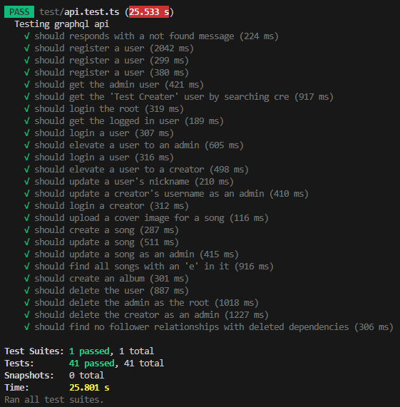
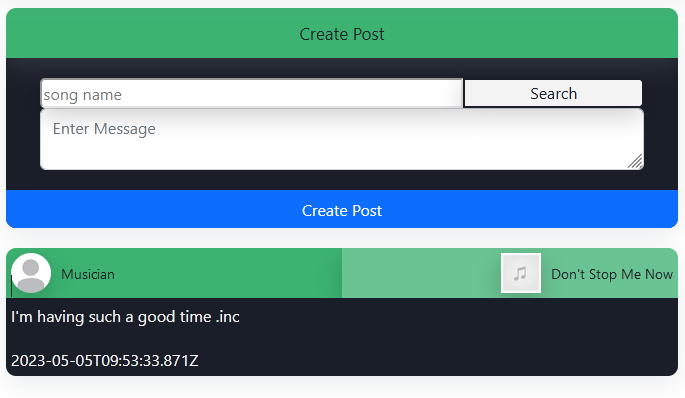
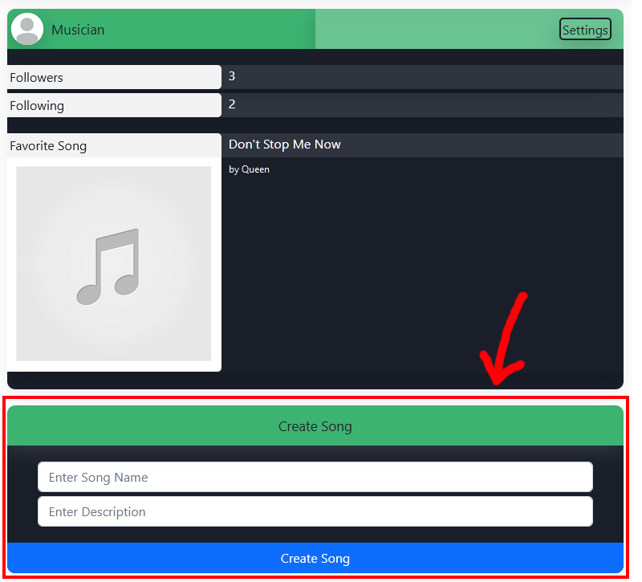
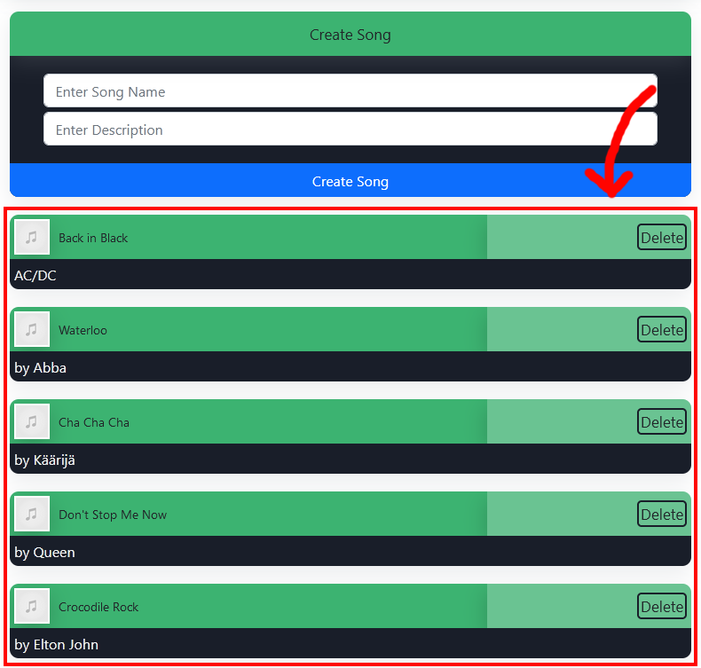

# soundbuds
Social media platform where you can find other people with the same music interests as you. You can follow other people and check out what their opinions are on music created by popular artists.

## Description
During the course "Server Side Scripting Frameworks" we had to make a personal project in which we would prove the skills we've learned during the course. In this project, I decided to create a login/registration system for users with four different roles and interactions between these users. It turned out fine, but getting all of the different social media interactions to work turned out to be harder than I first thought.

### Progress
As you can see in the image below this, the back-end was as done as it can be with functionalities of addming albums, adding songs to albums, adding covers for both of them, adding profile pictures and the front-end actually already checks if there is a cover/profile picture to display instead of the placeholder image, but sadly I wasn't able to implement these features in the front-end. The picture below is an overview of the passing tests.

### Roles
The roles I created were "user", "creator", "admin" and "root". The users are regular people with the bare privileges to follow users and create posts about music. The creators are regular users, but with the ability to create songs. Admins are users with the ability to edit or delete regular users and creators and the root is able to appoint admins and modify / delete anyone. The idea is that there is only one root and by doing this, admins can't abuse their powers to add / remove other admins.

### Index Page
After logging in, you see the index page. On this page you will see nothing except a search bar for searching users (searching for nothing shows all users). On the navigation bar you can click your own profile on the top-right and it will show you your user page.

### User page
If you are an admin / root or if this is your own page, you will see an edit button on the top right of your profile. Clicking this button gives you the ability to change your (nick)name, favorite song and profile color. Clicking on the edit button also reveals the delete button for deleting your own or their profile. If you are viewing another profile than your own, you will also see a follow button which you can click to follow / unfollow users. Following a user makes sure you see their posts on your index page.

#### Posts
On your own user page, you will also see a prompt on the top left to create a new post, on which you first need to search for a song (searching for nothing shows all songs) and select one to write a post about this song. Now you can write a message after you've picked a song and you can create a post, which will show up on the index page of everyone who follows you.

On the user's profile, all of their posts are displayed on the left side of the screen and on your own, they are shown under the "create post" prompt.

#### Songs
If your role is "Creator", you can create songs in the prompt underneath your user profile. On here you just need to provide a song name and description and it will add the song to the database for users to find when they are creating a post.

On the creator's profile, all of their songs are displayed on the right side of the screen underneath their profile. You can actually delete songs by clicking on the delete button on the top-right of a song and this will also delete all of the dependant posts.

### Full privileges for testing as the teacher
In order for you to test this platform, I will provide the root username and password, because the teacher still has to grade this project. By logging in as the root, you have full powers to modify any account. If you delete the root as the root, notify me and I will trigger a server restart so that a new root is created.

#### Root Credentials
- username: root
- password: tPLyvTOFK7

## Database Diagram

